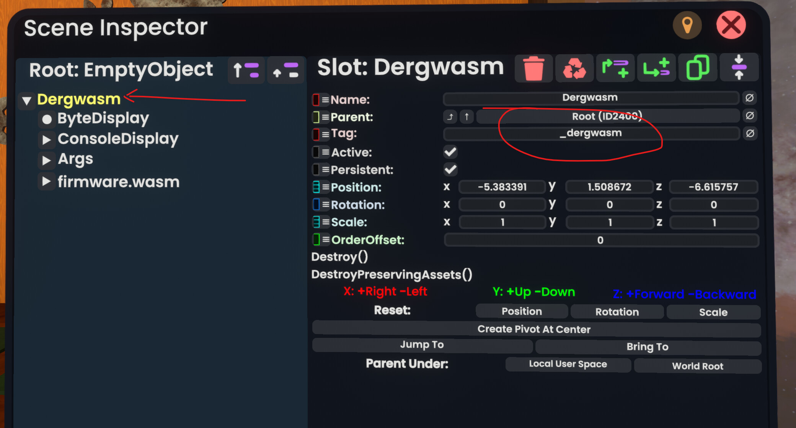
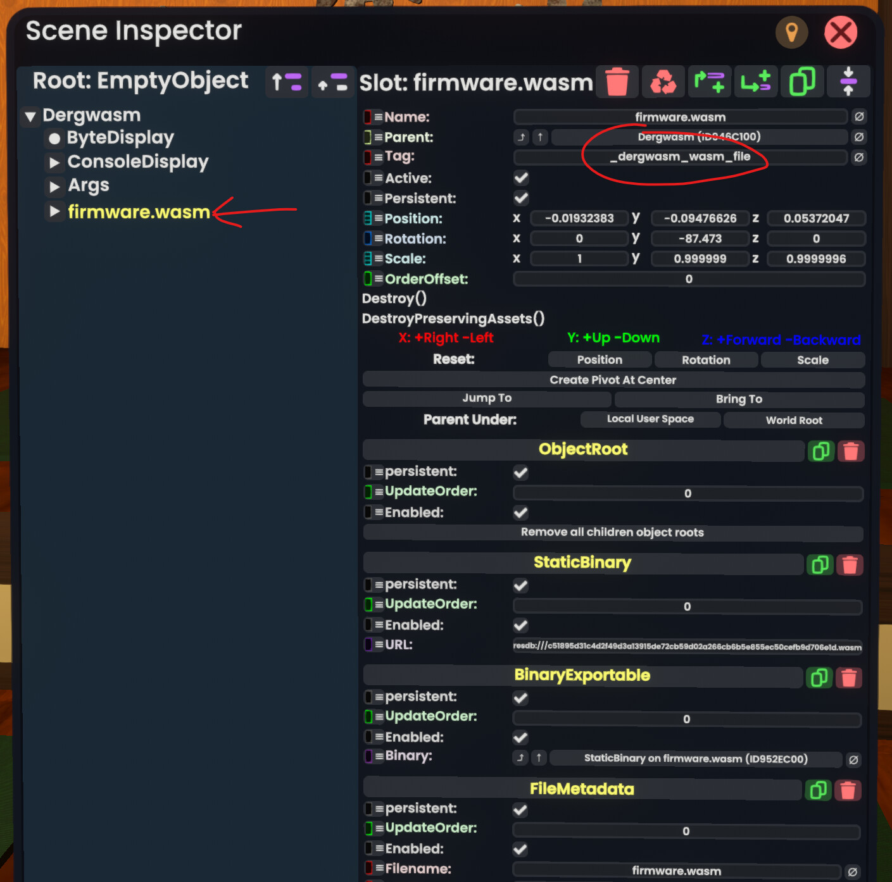
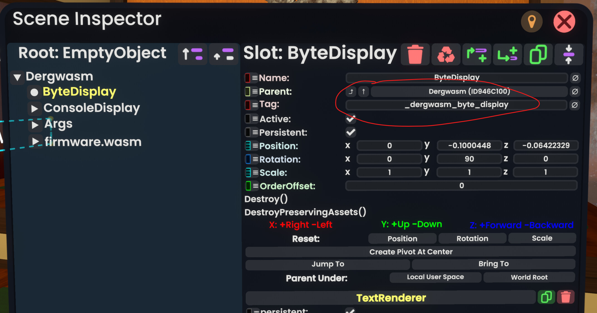
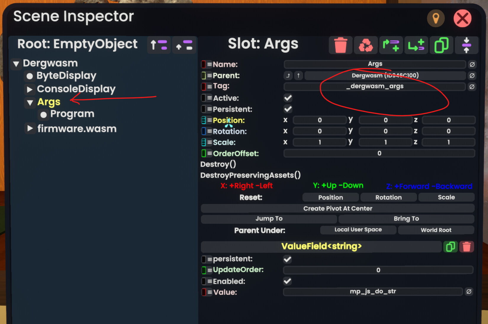
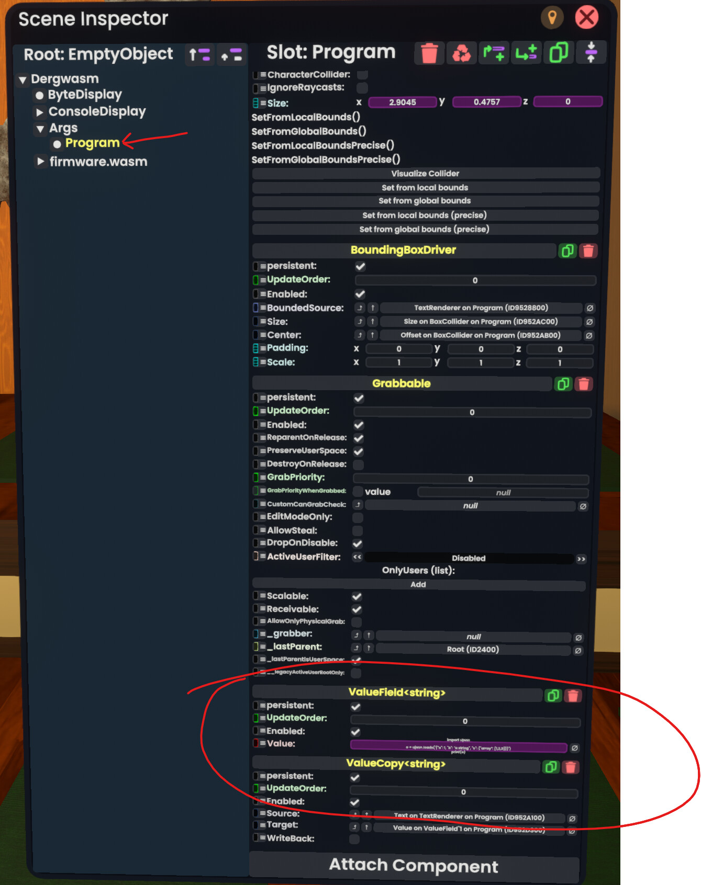
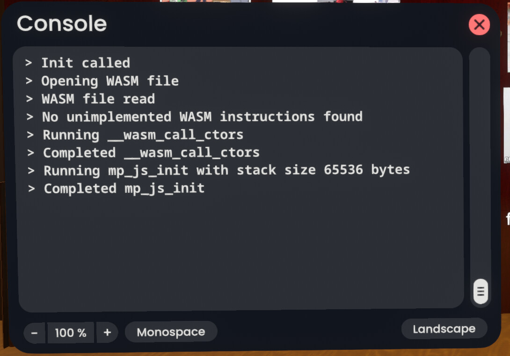

# Dergwasm

## Introduction

Dergwasm is a [WASM](https://en.wikipedia.org/wiki/WebAssembly) interpreter that runs as a mod in [Resonite](https://resonite.com/).

Several languages have support for compiling into WASM. Just to name a few:

* C/C++
* C#
* Ruby
* Rust
* Go
* Java
* and [more](https://www.fermyon.com/wasm-languages/webassembly-language-support)

Some of these languages don't actually compile into WASM, but rather provide a bytecode interpreter written in WASM. For example, Python.

> WARNING: Dergwasm is currently in alpha. This means that hardly any Resonite API methods have been implemented.

> NOTE: Dergwasm does not have access to your computer's filesystem, except for loading the WASM file you want to run.

## MicroPython

Dergwasm includes a WASM binary, `firmware.wasm`, which implements a [MicroPython](https://micropython.org/) interpreter. This means you can execute a subset of Python code in Resonite! MicroPython only supports syntax up to Python 3.4.

> NOTE: The MicroPython implementation does not have access to your computer's filesystem. Instead, it uses a slot as a virtual filesystem.

## Installation

> WARNING: Installation at this point isn't turnkey. You must be familiar with the Dev Tool, the inspector, and the ProtoFlux tool.

1. If you haven't already done so, install [Resonite Mod Loader](https://github.com/resonite-modding-group/ResoniteModLoader).
2. From the [latest release](https://github.com/RobertBaruch/dergwasm/releases), under Assets, download `Dergwasm.dll` and `firmware.wasm`.
3. Copy `Dergwasm.dll` into your `rml_mods` directory. See the [Resonite Mod Loader instructions](https://github.com/resonite-modding-group/ResoniteModLoader) for details about that.
4. Start Resonite. Now, in any world you visit, the mod attempts to create a slot under the root slot named `Dergwasm` with tag `_dergwasm` if it doesn't already exist.
   
5. For now, you have some work to do with this slot.
6. To verify that the mod loaded, you can look in your Resonite logs for something like this line:

    ```txt
    6:38:54 PM.614 ( -1 FPS)	[INFO] [ResoniteModLoader/Dergwasm] Dergwasm patches applied
    ```

### Initial configuration of the `Dergwasm` slot

1. Import `firwmware.wasm` into Resonite. Move its slot under the `Dergwasm` slot, and set its tag to `_dergwasm_wasm_file`. The name of the slot doesn't matter, since Dergwasm searches for it by tag. You can actually do this for any WASM file you have, but there must be only one.
   

2. Create a `Text` object with your Dev Tool and place its slot under the `Dergwasm` slot. Set its tag to `_dergwasm_byte_display`. Currently this object is only intended to display your computer's file path where it loads `firmware.wasm` from. It will not display anything at the moment.
    

3. Import any small text file into Resonite. You'll get a nice text viewer. Find the root slot of the text viewer and move it under the `Dergwasm` slot. Locate the `Vertical Layout > Body padding > Horizontal layout > ScrollRect > Content Area > Content` slot and set its tag to `_dergwasm_console_content`. This will display debug messages from Dergwasm, as well as any printed output from MicroPython.
    

4. Create a slot under the `Dergwasm` slot called `Args`, with tag `_dergwasm_args`.

5. Add a `ValueField<string>` component to `Args`. This contains the WASM function name you want to call.
    > If you're just interested in running MicroPython, the value in the field should be `mp_js_do_str`.
    

6. Under the `Args` slot, add as many slots as you want, one for each argument to the WASM function. Make sure the `OrderOffset` fields are set to order the slots according to the argument order. Each slot must have one `ValueField` component.
   > If you're just interested in running MicroPython, you only want one argument with a `ValueField<string>` component, containing your Python code. Here I used a `Text` object, and used a `ValueCopy` component to copy the text into the `ValueField<string>` component.
    

7. Create a `Dynamic Impulse Trigger` ProtoFlux node. Set its tag input to `_dergwasm` and its hierarchy input to your `Args` slot.
    

8. Save your world.

9. Close/Exit your world.

10. Re-enter your world. Dergwasm will load the WASM file and display where it found the file in the `_dergwasm_byte_display` text, and output any messages to the Resonite log and to `dergwasm_console_content`.
    

11. If there's nothing, check your logs for Dergwasm messages.

## Technical notes

WASM code is normally assumed to be running in a browser, but in general, it relies on a "host environment". Thus, compiled WASM code normally also comes with a JavaScript file which is the host environment. However, Dergwasm implements a host environment in C#.

Any "external" functions required by the WASM code are implemented in the host environment, whether that be JavaScript, or, as in Dergwasm, C#. This includes a Resonite API.

A WASM file requires all of its external functions to be present. If an external function is not present, Dergwasm will output a message to the Resonite log and to `dergwasm_console_content`, and you will not be able to do anything else until Dergwasm provides an implementation of that external function.

## Compilation

If you want to compile the mod, I'm not sure I captured all the requirements. At a minimum:

1. Use Visual Studio 2022 to load and build the Dergwasm project in `dergwasm_mod/Dergwasm/Dergwasm.sln`. This should give you `Dergwasm.dll`.

2. Use a Linux system, [install Emscripten](https://emscripten.org/docs/getting_started/downloads.html). I suggest using the `emsdk` tool.
3. On the Linux system, clone the [MicroPython repo](https://github.com/micropython/micropython).
4. Make a directory `user_modules/resonite` in the repo root.
5. Copy everything from `usercmodule/resonite` into that directory.
6. `cd ports/webassembly`
7. `make clean`
8. `make V=1 USER_C_MODULES=../../user_modules`
9. This should give you `build/firmware.wasm`.